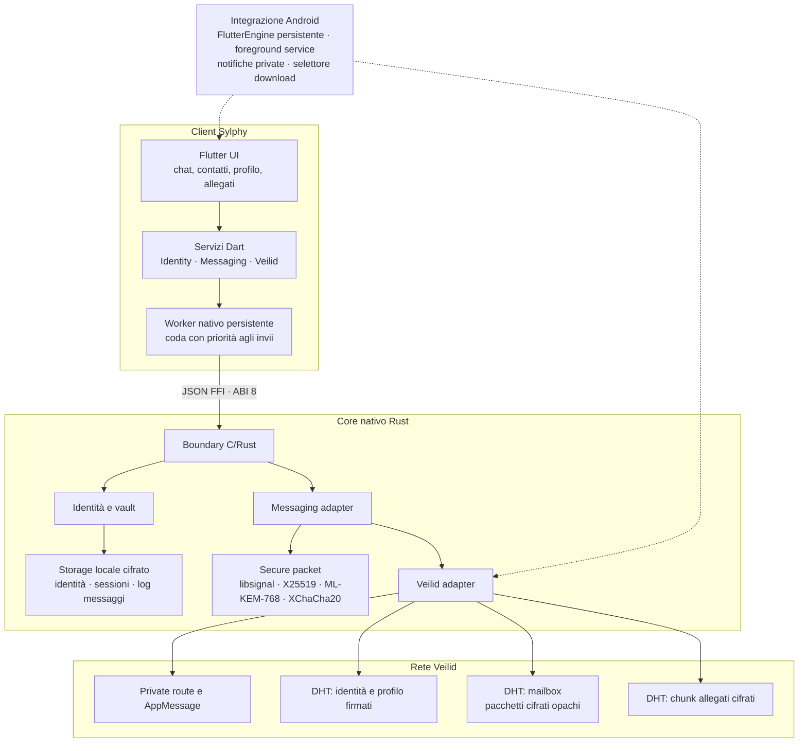

# Sylphy

## Aggiornamenti Android senza disinstallazione

Sylphy mantiene stabile l'`applicationId` e usa un `versionCode` crescente.
Per le build distribuite, copia `android/key.properties.example` in
`android/key.properties`, indica il keystore di release e conserva sempre la
stessa chiave di firma. Un APK con build number più alto potrà così essere
installato direttamente sopra la versione precedente, mantenendo profilo,
vault e messaggi locali.

Sylphy è un messenger peer-to-peer privato per Android, Windows e Linux. Integra
[Veilid](https://veilid.com/) direttamente nell'applicazione e mantiene identità,
crittografia e cronologia sensibile nel core nativo Rust: la rete riceve soltanto
record pubblici firmati o dati cifrati opachi.

Il progetto punta a offrire un'esperienza da messenger tradizionale senza un
server centrale che custodisca account, contatti e conversazioni.

> [!WARNING]
> Sylphy è software in sviluppo e non è stato sottoposto a un audit di sicurezza
> indipendente. Non deve essere considerato, allo stato attuale, uno strumento
> verificato per scenari ad alto rischio.

## Funzionalità

- identità Sylphy firmata, condivisibile tramite ID o invito `sylphy:`;
- contatti peer-to-peer con nome, foto profilo e fingerprint verificabile;
- messaggi end-to-end encrypted, consegna diretta quando il destinatario è
  raggiungibile e mailbox DHT cifrata per la consegna differita;
- ricezione persistente: un elemento della mailbox viene confermato solo dopo il
  salvataggio nel vault locale;
- servizio foreground Android e notifiche senza anteprima del testo quando
  l'interfaccia dell'app è chiusa;
- allegati cifrati, pulsante di download e anteprima delle immagini direttamente
  nella conversazione;
- collegamento cifrato tra computer e telefono tramite file account protetto da
  password, con identità, contatti, cronologia e sessioni Double Ratchet;
- sincronizzazione multi-dispositivo dei nuovi contatti e messaggi attraverso
  un journal cifrato conservato nella mailbox Veilid condivisa;
- UI Flutter adattiva per telefono e desktop;
- core Rust fail-closed: in assenza dell'ABI nativa l'app non simula contatti,
  messaggi o stato di rete.

## Cos'è Veilid

[Veilid](https://veilid.com/how-it-works/) è un framework open source per creare
applicazioni completamente distribuite. Può essere incorporato direttamente in
un'app oppure eseguito come nodo headless e non richiede blockchain, token o un
livello transazionale.

Per Sylphy fornisce tre primitive principali:

1. **Private routing.** Il mittente sceglie una *Safety Route* e il destinatario
   pubblica una *Private Route*; le due parti vengono combinate e ciascun hop
   conosce soltanto quello successivo. La documentazione ufficiale descrive il
   meccanismo come simile all'onion routing.
2. **DHT.** Record distribuiti, subkey indirizzabili e scrittori autorizzati
   consentono di pubblicare identità firmate, mailbox e chunk cifrati senza un
   database centrale. I record sono eventualmente consistenti.
3. **Messaggi applicativi.** Quando un peer è raggiungibile, Sylphy tenta anche
   una consegna diretta tramite `AppMessage`; la mailbox resta il percorso
   durevole per i destinatari offline.

Approfondimenti ufficiali:
[private routing](https://veilid.com/how-it-works/private-routing/),
[RPC e DHT](https://veilid.com/how-it-works/rpc/) e
[networking](https://veilid.com/how-it-works/networking/).

## Perché Veilid invece di un'architettura basata su Tor

Sylphy non sostiene che Veilid sia universalmente “migliore di Tor”. Per un
messenger mobile-first e completamente distribuito, tuttavia, Veilid offre
vantaggi architetturali concreti:

| Aspetto | Sylphy con Veilid | Alternativa con Tor Onion Services |
| --- | --- | --- |
| Integrazione | `veilid-core` è una libreria incorporata nel processo dell'app | normalmente occorre gestire un client/daemon Tor e il ciclo di vita di un Onion Service |
| Primitive applicative | private routing, RPC, DHT e messaggi peer-to-peer fanno parte dello stesso framework | Tor fornisce il trasporto anonimo e l'endpoint onion; discovery, mailbox offline e modello dati restano a carico dell'app |
| Consegna offline | mailbox cifrata implementata su record e subkey DHT Veilid | richiede un servizio sempre raggiungibile o uno storage/protocollo aggiuntivo |
| Operatività | ogni app è anche un nodo; non serve amministrare un backend onion dedicato | un Onion Service deve pubblicare descrittori e mantenere circuiti verso gli introduction point |
| Percorso predefinito | la route compilata Veilid usa attualmente tre hop; l'app può richiederne di più | una connessione Onion Service completa usa normalmente sei relay, tre per lato |
| Uso mobile | integrazione nativa e percorso più corto possono ridurre overhead e latenza; Sylphy sposta le operazioni native fuori dall'isolate UI | circuiti più lunghi e un componente Tor separato possono avere un costo maggiore di avvio, memoria e rete |

La superiorità, quindi, riguarda **l'integrazione di un messenger distribuito**:
meno componenti da orchestrare e DHT/offline delivery disponibili nello stesso
framework di rete. Non è un'affermazione di superiorità assoluta in termini di
anonimato. Tor è un progetto più maturo, con una rete di relay più ampia e un
modello molto studiato; per navigazione anonima, resistenza alla censura e scenari
ad alto rischio rimane un riferimento. Anche Veilid presenta esplicitamente il
numero di hop come un compromesso tra prestazioni e sicurezza.

Il funzionamento degli Onion Services e del rendezvous a sei relay è documentato
dal [Tor Project](https://community.torproject.org/onion-services/overview/index.html).

## Architettura corrente



### Invio di un messaggio

1. Flutter valida l'input e lo accoda al worker nativo persistente; gli invii
   hanno priorità rispetto alla manutenzione periodica dell'inbox.
2. Il core Rust carica contatto e chiavi dal vault cifrato.
3. `libsignal` aggiorna la sessione Double Ratchet e produce un ciphertext
   Signal/PreKey; l'envelope esterno applica anche il bootstrap ibrido X25519 +
   ML-KEM-768 e l'autenticazione Sylphy.
4. Viene tentata prima la private route; la mailbox DHT è il fallback durevole.
5. Sessione e copia locale vengono persistite prima della conferma alla UI.

### Ricezione e consegna offline

1. Il nodo controlla periodicamente gli `AppMessage` e i 31 slot della mailbox.
2. Il core verifica firma, destinatario, limiti e chiavi prima della decifratura.
3. Il messaggio viene salvato nel vault locale.
4. Solo dopo la persistenza lo slot DHT viene svuotato; un arresto intermedio non
   conferma il messaggio e consente un tentativo successivo.
5. Su Android il servizio foreground mantiene il motore attivo e genera una
   notifica priva di plaintext. Un *force stop* esplicito dell'app da parte
   dell'utente o del sistema impedisce comunque qualsiasi elaborazione in
   background fino alla riapertura.

## Modello di sicurezza

| Livello | Implementazione corrente |
| --- | --- |
| Identità e autenticità | Ed25519, bundle pubblico firmato e fingerprint verificabile |
| Accordo delle chiavi | schema ibrido one-shot X25519 + ML-KEM-768 |
| Cifratura messaggi | Signal Double Ratchet ufficiale dentro envelope XChaCha20-Poly1305 autenticati |
| Dati locali | identità Argon2id; sessioni per contatto e log incrementale cifrati XChaCha20-Poly1305 |
| Allegati | chiave casuale per file, XChaCha20-Poly1305 e chunk DHT cifrati; limite applicativo 700 KiB |
| Metadati pubblici | identità, prekey, route e profilo firmati; mai la cronologia in chiaro |
| Trasporto | private routing Veilid, mailbox DHT e consegna diretta best-effort |

I nuovi bundle pubblicano prekey EC e Kyber di `signalapp/libsignal`, legate
all'identità Sylphy tramite firma Ed25519. Due client aggiornati usano sempre il
ciphertext Signal; un contatto precedente senza il nuovo bundle resta sul
formato ibrido di compatibilità finché non ripubblica il proprio ID.

To-Do >>

## Struttura del repository

```text
lib/                     UI Flutter e servizi applicativi
native/core/             core Rust, crittografia, persistenza e Veilid
android/                 host Android, servizio e notifiche
linux/                   runner desktop Linux
windows/                 runner desktop Windows
specs/                   contratti Flutter/native e note architetturali
test/                    test Dart e widget
.github/workflows/       analisi, test e packaging CI
```

## Sviluppo

### Prerequisiti

- Flutter compatibile con Dart `^3.9.2`;
- Rust `1.89` o successivo;
- `protoc` per le dipendenze native;
- Android: Java 17, Android SDK/NDK `28.2.13676358`, target Rust e `cargo-ndk`;
- Windows: Visual Studio Build Tools con workload C++;
- Linux: Clang, CMake, Ninja, GTK 3 e liblzma.

### Dipendenze Flutter

```bash
flutter pub get
```

### Core nativo

Windows:

```powershell
./native/build-windows.ps1
```

Android:

```powershell
./native/build-android.ps1
```

Linux:

```bash
bash ./native/build-linux.sh release
```

Gli script compilano il core con le feature `veilid,signal-ratchet` e copiano la
libreria nella destinazione prevista dal runner. Ulteriori dettagli sono in
[`native/README.md`](native/README.md),
[`specs/native-core.md`](specs/native-core.md) e
[`specs/flutter-client.md`](specs/flutter-client.md).

### Avvio

```bash
flutter run -d <device-id>
```

### Controlli di qualità

```bash
flutter analyze
flutter test
cargo test --manifest-path native/core/Cargo.toml --features veilid,signal-ratchet
```

## Limiti noti

- nessun audit indipendente del protocollo o dell'implementazione;
- il percorso Double Ratchet non è ancora usato dai messaggi reali;
- gli allegati sono limitati a 700 KiB;
- la mailbox ha capacità finita e consistenza eventuale, quindi non equivale a
  una coda centralizzata con disponibilità garantita;
- le notifiche persistenti in background sono implementate specificamente per
  Android; le politiche energetiche del produttore possono comunque sospendere
  il processo;
- la verifica manuale del fingerprint è un indicatore di fiducia e non sostituisce
  un audit del dispositivo o del software.

## Dipendenze e licenze

Il core usa `veilid-core 0.5.7` e include `signalapp/libsignal` fissato a una
revisione specifica. `libsignal` è distribuito con licenza AGPL-3.0-only: prima
di distribuire binari combinati è necessario verificare gli obblighi indicati in
[`THIRD_PARTY_NOTICES.md`](THIRD_PARTY_NOTICES.md).
