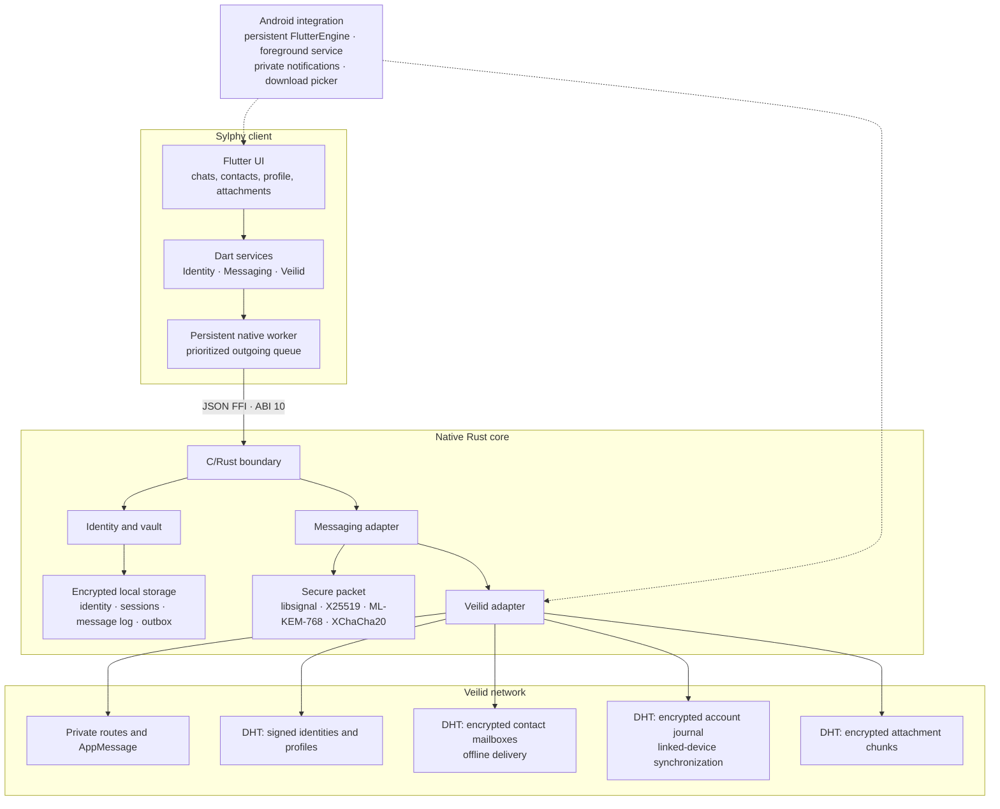

# Sylphy

Sylphy is a private peer-to-peer messenger for Android, Windows and Linux. It
embeds [Veilid](https://veilid.com/) directly in the application and keeps
identity, cryptography and sensitive history in a native Rust core. The network
receives only signed public records or opaque encrypted data.

The project aims to provide a familiar messaging experience without a central
server holding accounts, contacts and conversations.

> [!WARNING]
> Sylphy is under development and has not undergone an independent security
> audit. It should not currently be treated as a verified tool for high-risk
> situations.

## Features

- Signed Sylphy identities shared through an ID or a `sylphy:` invitation.
- Peer-to-peer contacts with names, profile pictures and verifiable fingerprints.
- End-to-end encrypted messages with direct delivery and encrypted offline
  storage on Veilid, using separate capabilities for each contact, direction and
  device.
- An encrypted DHT journal for devices belonging to the same account, with
  acknowledgements issued only after local persistence.
- An Android foreground service and notifications without message previews when
  the app interface is closed.
- Encrypted attachments, download controls and inline image previews.
- Encrypted computer-to-phone account linking through a password-protected
  account file containing identity, contacts and history. Each device creates
  its own device identity and Signal sessions to avoid cloning ratchet state.
- Synchronization of new contacts and messages across linked devices through
  direct delivery, with an encrypted Veilid journal as a fallback.
- Adaptive Flutter UI for phones and desktops.
- A Rust core that fails closed: when the native ABI is unavailable, the app
  does not simulate contacts, messages or network status.

## What is Veilid?

[Veilid](https://veilid.com/how-it-works/) is an open-source framework for fully
distributed applications. It can be embedded in an app or run as a headless node
and does not require a blockchain, tokens or a transaction layer.

Sylphy uses three main primitives:

1. **Private routing.** The sender selects a *Safety Route* and the recipient
   publishes a *Private Route*. Combining them hides the complete path from
   individual relays. The official documentation describes a mechanism similar
   to onion routing.
2. **DHT.** Distributed records, addressable subkeys and authorized writers
   provide storage for signed identities, device journals and encrypted chunks
   without a central database. Records are eventually consistent.
3. **Application messages.** Sylphy attempts direct delivery through
   `AppMessage` when a peer is reachable. If direct handoff fails, updated clients deposit encrypted
   packets in a mailbox specific to the contact pair so recipients can retrieve
   them when they return online.

Official documentation:
[private routing](https://veilid.com/how-it-works/private-routing/),
[RPC and DHT](https://veilid.com/how-it-works/rpc/), and
[networking](https://veilid.com/how-it-works/networking/).

## Why Veilid for this architecture?

Veilid provides routing and distributed storage in one embedded framework,
which suits a fully distributed mobile messenger. A design using Tor Onion
Services would need its own discovery, mailbox and data-storage components.

| Aspect | Sylphy with Veilid | Design using Tor Onion Services |
| --- | --- | --- |
| Integration | `veilid-core` runs inside the application process | Requires managing a Tor client and an Onion Service lifecycle |
| Application primitives | Private routing, RPC, DHT and peer-to-peer messages share one framework | Tor provides transport and an onion endpoint; discovery and storage belong to the application |
| Offline delivery | Sylphy uses DHT mailboxes for contacts and encrypted journals for linked devices | Requires reachable storage or an additional storage protocol |
| Operations | Each app is a node; no dedicated onion backend is required | Services manage descriptors and introduction-point connections |

This choice reduces the number of components Sylphy needs to integrate. It is
not a claim that Veilid provides stronger anonymity than Tor. Routing choices
involve security and performance tradeoffs; this project has no comparative
anonymity or performance audit.

For the Onion Service connection model, see the
[Tor Project documentation](https://community.torproject.org/onion-services/overview/index.html).

## Current architecture



### Sending a message

1. Flutter validates input and queues the command on its persistent native
   worker, prioritizing sends over periodic inbox maintenance.
2. The Rust core loads the contact and keys from the encrypted vault.
3. Official `libsignal` advances the Signal session and produces a Signal/PreKey
   ciphertext. The outer envelope also applies Sylphy authentication and the
   hybrid X25519 + ML-KEM-768 scheme.
4. The core persists the session, local message and encrypted outgoing packet.
5. Background network work attempts direct delivery and, if it fails, for peers
   advertising `offline-mailbox-v1`, deposits the encrypted packet in their contact mailbox.
   Failed attempts remain queued and retry automatically, including after a
   restart. Older peers retain the direct-delivery path.

### Receiving messages

1. The node periodically processes `AppMessage` events, contact mailboxes and
   the encrypted journal shared by devices on the same account.
2. The core verifies signatures, recipient, bounds and keys before accepting
   decrypted content, and deduplicates repeated deliveries.
3. It saves the message and commits the Signal session locally.
4. Only after persistence does it acknowledge the DHT entry. Contact mailboxes
   use a separate acknowledgement subkey; the account journal clears processed
   slots. An interrupted receive can therefore be retried.
5. On Android, the foreground service keeps the engine active and produces
   notifications without message plaintext. A force stop prevents background
   processing until the app is reopened; system power policies can also suspend
   the process.

## Security model

| Layer | Current implementation |
| --- | --- |
| Identity and authenticity | Ed25519, signed public bundles and verifiable fingerprints |
| Key agreement | Hybrid one-shot X25519 + ML-KEM-768 |
| Message encryption | Official Signal ratchet inside authenticated XChaCha20-Poly1305 envelopes |
| Local data | Argon2id identity protection; encrypted per-contact sessions and incremental XChaCha20-Poly1305 message logs |
| Attachments | Random per-file keys, XChaCha20-Poly1305 and encrypted DHT chunks; application limit of 700 KiB |
| Public metadata | Signed identities, prekeys, routes and profiles; no plaintext message history |
| Transport | Veilid private routing, contact-pair DHT mailboxes and a private journal for devices belonging to the same account |

Public bundles include EC and Kyber prekeys from `signalapp/libsignal`, bound to
the Sylphy identity by an Ed25519 signature. Updated clients use Signal
ciphertexts. Contacts without the required Signal bundle are explicitly
rejected and must republish their ID.

## Messages to offline recipients

Two updated clients that have already added each other's IDs can exchange
messages without being online at the same time. The sender first saves the
message in its encrypted local outbox. A worker attempts direct delivery and,
if it fails, stores the encrypted packet in the Veilid mailbox. Once the deposit is
confirmed, the sender can close Sylphy. The recipient retrieves messages on
returning online within the **7-day retention window**, subject to the records
remaining available in the DHT.

Each mailbox holds **32 unacknowledged messages per device pair and direction**.
The recipient acknowledges only after saving locally, allowing slots to be
reused without overwriting pending messages. When the network or mailbox is
unavailable, messages remain in the local queue and retry automatically, even
after a restart. A clock indicates a pending send; a single check mark means
handoff to the network, not that the recipient has read the message.

Update and reopen Sylphy on both devices to publish the new capability. A first
message from an unknown sender still requires direct delivery or mutual ID
imports. Implementation details and a verification procedure are available in
[`specs/offline-delivery.md`](specs/offline-delivery.md).

## Repository layout

```text
lib/                     Flutter UI and application services
native/core/             Rust core, cryptography, persistence and Veilid
android/                 Android host, service and notifications
linux/                   Linux desktop runner
windows/                 Windows desktop runner
specs/                   Flutter/native contracts and architecture notes
test/                    Dart and widget tests
.github/workflows/       CI analysis, tests and packaging
```

## Development

### Prerequisites

- Flutter compatible with Dart `^3.9.2` (CI uses Flutter `3.35.5`).
- Rust `1.93.1` or later, as required by the pinned libsignal dependencies.
- `protoc` on `PATH`, or its executable path in `PROTOC`.
- Android: Java 17, Android SDK/NDK `28.2.13676358`, Rust targets and `cargo-ndk`.
- Windows: Visual Studio 2022 Build Tools with the C++ workload for Flutter
  `3.35.5` and the MSVC Rust target.
- Linux: Clang, CMake, Ninja, GTK 3, liblzma, libsecret and libjsoncpp development
  packages.

### Flutter dependencies

```bash
flutter pub get
```

### Native core

Windows:

```powershell
./native/build-windows.ps1
```

Android:

```powershell
./native/build-android.ps1
```

Linux:

```bash
bash ./native/build-linux.sh release
```

These scripts compile with `veilid,signal-ratchet` and copy the native library
to the location expected by the platform runner. Rebuild the native libraries
after changing Rust dependencies: existing binaries do not acquire a libsignal
upgrade from `flutter pub get` alone.

See [`native/README.md`](native/README.md),
[`specs/native-core.md`](specs/native-core.md), and
[`specs/flutter-client.md`](specs/flutter-client.md) for further details.

### Run

```bash
flutter run -d <device-id>
```

### Quality checks

```bash
flutter analyze
flutter test
cargo fmt --manifest-path native/core/Cargo.toml -- --check
cargo test --locked --manifest-path native/core/Cargo.toml --features veilid,signal-ratchet
cargo check --locked --manifest-path native/core/Cargo.toml --features veilid,signal-ratchet
```

## Known limitations

See [September reliability fixes](specs/reliability.md) for backup recovery,
linked-device synchronization, chat pagination, and Android signing setup.

- The protocol and implementation have not undergone an independent audit.
- Attachments are limited to 700 KiB.
- Offline mailboxes have bounded retention and capacity. Availability depends
  on the DHT; they are not permanent storage.
- The linked-device journal has finite capacity and eventual consistency.
- Persistent background notifications are implemented specifically for Android;
  manufacturer power policies may still suspend the process.
- Manual fingerprint verification is a trust signal, not a substitute for an
  audit of the device or software.

## Dependencies and licenses

The core uses `veilid-core 0.5.7` and official
[`signalapp/libsignal v0.102.1`](https://github.com/signalapp/libsignal/releases/tag/v0.102.1),
pinned to commit `ea42ed0ed3e2ae119282d98253c35a28cce02414`. The native
`Cargo.lock` records the resolved dependencies for reproducible builds.

Libsignal is licensed under AGPL-3.0-only. Review the obligations documented in
[`THIRD_PARTY_NOTICES.md`](THIRD_PARTY_NOTICES.md) before distributing combined
binaries.
